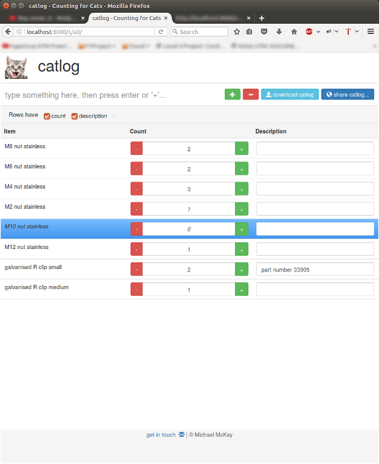

# catlog
A webapp enabling users to count and search sets things- fun databases.

[Try catlog out!](https://tranquil-peak-49937.herokuapp.com/c/1A/)

The webapp generates unique links for each data table, e.g. `/c/VeZR/` or allows users to specify their own links, e.g. `/c/johns-toolbox`.

Links can be shared to produce collaborative data tables.

Some uses of catlog:

* stock taking (quickly check if an item has been counted before)
* party invites (add new rows for new people and use 'count' for guests, etc.)
* agreeing on a common time to meet
...
!

